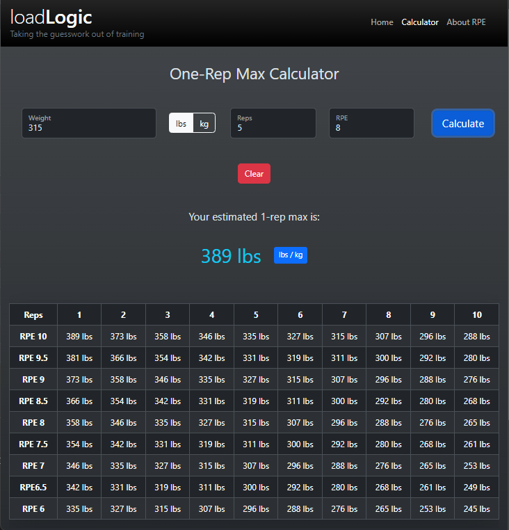

# One Rep Max Calculator Portfolio Project

 [View the deployed website](https://65d7efbf7551276fb0911444--loadlogic.netlify.app/)

## Purpose

The purpose of this project is to allow a user to enter the weight they can lift for a specified number of repetitions at a specified RPE (rate of perceived exertion), and calculate their estimated one-rep max as well as display a chart showing the estimated amount of weight they can lift in different repetition ranges and RPE's. 

If you are unfamiliar with the concept of RPE, I wrote a short article on the About RPE page to explain it.

## Tech Stack

- HTML
- CSS (Bootstrap)
- Javascript

## Skills demonstrated

- Responsive web design
- JavaScript event handling
- JavaScript form validation
- Fundamental programming concepts (loops, arrays, arithmetic, decisions)

## How to test the calculator

If you are not interested in resistance training, you might not know what values to enter in the calculator inputs. Here are some test runs you can try:

#### Successful runs with valid data

- Weight: 315 lbs (check lbs radio button), Reps: 5 RPE: 8 
- Weight: 170 kg (check kg radio button), Reps: 3, RPE: 9

#### Unsuccessful runs with invalid data

- Weight: 0, Reps: 11, RPE: 5 (all values are out of range)
- Weight: 100, Reps: 1.5, RPE: 6.5 (reps should be invalid, only whole numbers are allowed)
- Weight: 100, Reps: 5, RPE: 6.52 (RPE should be invalid, must be in steps of 0.5)
- Note that inputs are also validated when they lose focus, not only on form submission

On successful runs, make sure to test the lbs / kg toggle button. This changes both the 1-rep max and the table values.

In addition to the calculator function, you can test the responsive layout changes on all pages at different window sizes. I provided a link to the site above so you can even view it on your mobile device.

Please let me know if you notice any bugs/issues during your testing. <socholotuikt@gmail.com>.

## Challenges I Faced In This Project

1. Calculating the one-rep max was not as straight-forward as you might assume. The formula is simple ((Weight * 100) / %1RM), but the % of 1-rep max variable is unique to **every** rep and RPE combination, so this necessitated the use of a 2D jagged array to store the percentage values for each RPE and Rep pair. To calculate the table values, I had to traverse this array and calculate the weight estimate for each rep and RPE pair in each iteration of the loop. The result had to be stored in a second parallel 2D jagged array. This array was then used to populate the table by selecting \<td> elements with id's containing the indexes of each rep and RPE value. This was my first time working with 2D arrays, and it exercised my critical-thinking and problem solving skills.

2. Toggling the weight unit (lbs / kg) was more difficult than I expected and I had many logic errors before arriving at a working solution. I could have had 2 separate buttons for lbs and kg, but I wanted to overcome the challenge.

3. I had not used Bootstrap or any other CSS libraries prior to this project, so I spent a lot of time reading the documentation to understand the behaviour of the classes. I wanted this website to look modern and professional, so the use of a library was necessary for some components that are above my current skill level (sidebar nav, tooltips, floating form labels). The ability to self-learn and read documentation is an essential skill for software developers, so I was happy to go through this process.

4. I am not an artist or a designer, so creating an aesthetically pleasing website was a challenge for me. A lot of trial and error was involved in creating the layouts for each window size. 

## Future Goals For This Project

After I learn about server-side scripting and connecting to databases, I would like to turn this into a training log app that allows users to create custom workout templates, log their workout data (exercise, weight, sets, reps, RPE), recall past workouts, and view progress analysis charts. 

## Closing Message

Thank you for taking the time to review my project. Although a one-rep max calculator is not a useful application for the majority of people, I feel that it is an excellent demonstration of my current programming skills and self-motivation. 
